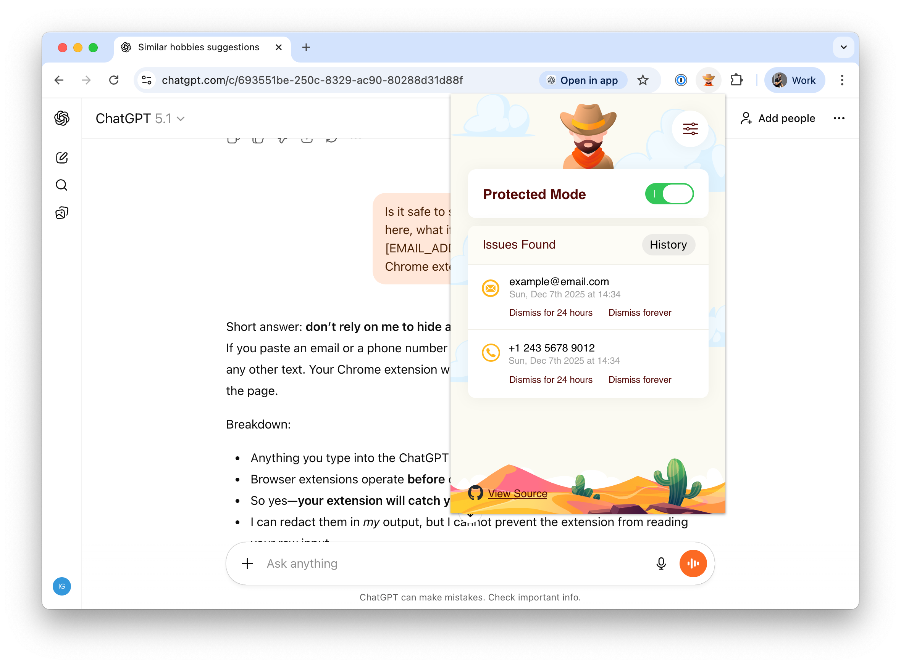
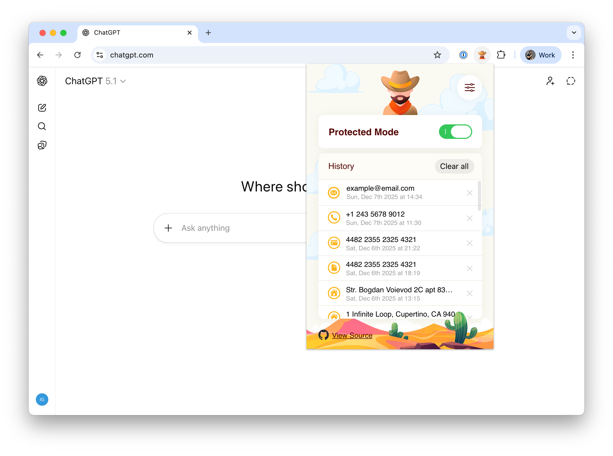
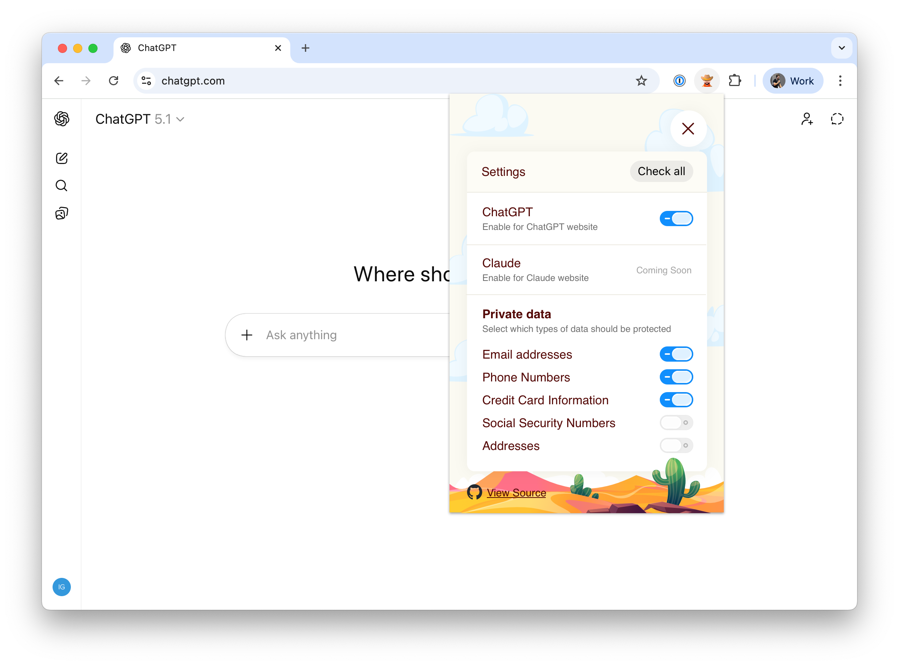

# Prompt Wrangler

Chrome extension that detects and anonymizes sensitive data in AI chat prompts.

## Tech Stack

React + TypeScript + Vite + Sass + Chrome Extension Manifest V3

## Commands

```bash
npm install              # Install dependencies
npm run dev              # Start dev server
npm run build            # Production build
npm run build:watch      # Build and watch for changes
npm run lint             # Run ESLint + stylelint
npm run lint:fix         # Auto-fix linting issues
npm run format           # Format with Prettier
npm run type-check       # TypeScript type checking
npm run test             # Run tests
```

## Development

### Chrome Extension Setup

1. Build and load in Chrome:
   - Run `npm run build`
   - Open `chrome://extensions`
   - Enable "Developer mode"
   - Click "Load unpacked" → select `dist/` folder

2. After code changes, rebuild and click the refresh icon in `chrome://extensions`

## Design Previews

### Issues Found

| Screenshot |
|------------|
|  |

### History View

| Screenshot |
|------------|
|  |

### Settings View

| Screenshot |
|------------|
|  |
